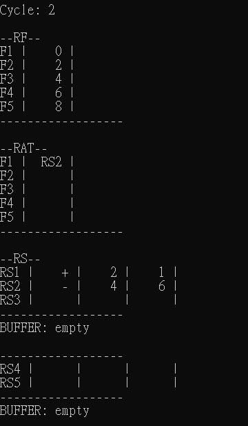
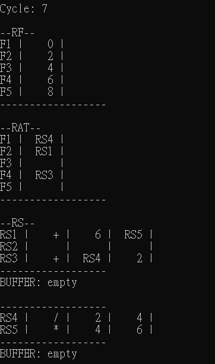
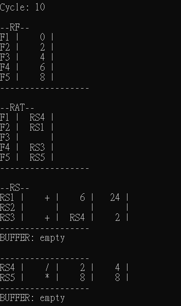
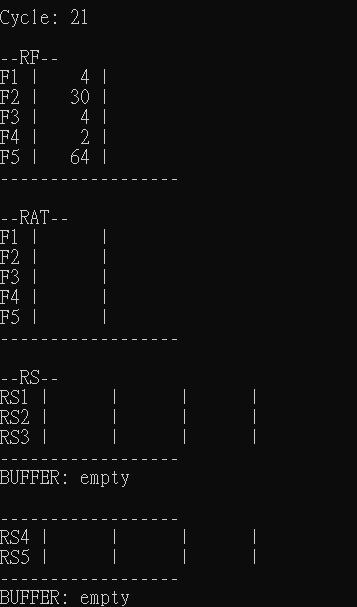

# ALCO_project3
## Introduction
  - You can see complete introduction in this [LINK](https://hackmd.io/@wycchen/1102ALCO#Project-3-Tomasulo)
  - Write a Tomasulo program
  
## Tomasulo (introduction from Wikipedia)
  - Tomasulo's algorithm is a computer architecture hardware algorithm for dynamic scheduling of instructions that allows **out-of-order** execution and enables more efficient use of multiple execution units. It was developed by Robert Tomasulo at IBM in 1967.
  - The major innovations of Tomasulo’s algorithm include **register renaming(RAT)** in hardware, **reservation stations(RS)** for all execution units, and a common data bus (CDB) on which computed values broadcast to all reservation stations that may need them. These developments allow for improved parallel execution of instructions that would otherwise stall under the use of scoreboarding or other earlier algorithms.
  
## Documentation

**0. Rules**
  - four main function
    - issue
    - execute ( dispatch )
    - write ( write reasult to register )
    - print ( only print if the table is changed )
  - finish issue at least wait one cycle -> execute ( if cycle 1 in issue, at least wait for cycle 2 in execute )
  - when issue instruction, check RAT first, if have no corresponce than check RF, and put to RS
  - one ALU finish execute, wait at least one cycle -> execute ( if cycle 4 finish execute, at least wait for cycle 5 in execute, if no dependency )
  - ADD and MUL ALU can execute at the same time ( ADD, ADDI and SUB use same ALU, MUL and DIV use same one )
  - register renaming(RAT) have 5 vacancies 
  - reservation stations(RS) have 3 vacancies for ADD, 5 vacancies for MUL
  - register file (RF) have 6 variable
  
**1. Initialize some global variables**

    bool done = true;                                   //if done = true, finish program
    int writeback = 0;                                  //record how many times instruction write back, if #(writeback) equals to #(instruction), finish program
    int cur_issue = 0;                                  //record which instruction is in execution
    const int iss_Lat = 1;                              //equal or larger -> into execute(dispatch) function
    const int wr_Lat = 1;                               //equal -> write function
    const int ADD = 2;                                  //each operator need how many cycles execute -> finish execute
    const int MUL = 4;                                  //
    const int DIV = 10;                                 //
    int cycle = 0;                                      //record how many cycle  
    string rf[6] = { "0","0","2","4","6","8" };         //set register file

    
**2. Define some class**

    class RS {                                //RS ( register renaming )
    public:	                                  //
      bool busy = false, disp = false;        //if busy = ture means rs has instruction, disp = true ready to write
      string rs1, rs2, OP, RD;                //RD = rs1 OP rs2
      int result;                             //result = finish execute answer
      int iss_lat = 0, wr_lat = 0,            //compare to global variable ( iss_Lat、wr_Lat )
      inst = 1000, op, lat;                   //record which instruction，lat -> how many cycle (equals to global variable( ADD MUL DIV ready to write reasult)
    };

    class RAT {                               //RAT ( register file )
    public:                                   //
      bool busy = false;                      //if busy = ture means rs has instruction
      string rat;                             //put rd result
    };

    class INST {                              //instruction
    public:                                   //
       string rd, rs, rt, op;                 //input order -> op rd rs rt ，rd = rs op rt
       int issClock, exeBegin,                //record which cycle finish issue、in execute、
       exeEnd, wrBack;                        //record which cycle finish execute、finish write
    };
    
**3. main function**

    vector<INST> INST(50);                                    //at most input 49 instruction
    int k = 0;                                                //紀錄幾個instrution
    while (true)
    {                                                         //input order -> op rd rs rt ，rd = rs op rt
      cin >> INST[k].op;                                      //input operator
      if (INST[k].op == "0")                                  //if input 0 means finish input instruction -> break loop
           break;
      cin>> INST[k].rd >> INST[k].rs >> INST[k].rt;
      k++;
     }
     -----------------------------------------------------------------------------------------------------------------------
     do {
      cycle++;                                          
      is = false;                                       //initalize 
      wr = false;                                       //initalize
      issue(INST, RS, RAT, k);                          //run issue function
      execute(INST, RS, RAT, k);                        //run execute function
      write(INST, RS, RAT, k);                          //run write function
      if (is || wr)                                     //use 2 bool record whether change the table 
        print(RS, cycle, buffer, RAT);                  //one of 2 bool is true -> print

      done = false;
      if (writeback == k)                               // #( writeback ) equals to k(#instruction) means finish all instruction
        done = true;
      } while (!done);
      
**4. issue function ( take ADD for example )**

    switch (inst[cur_issue].op[0])                  //use first alphabet to judge which operator of input op
    case 'A':                                       //'A'= ADD or ADDI; 'S'= SUB; 'M'= MUL; 'D'= DIV
      for (int i = 0; i < 3; i++){
        if (!rs[i].busy) {
          pos = i;
          if (inst[cur_issue].op[3] == 'I')
            rs[i].op = 1;                           //seperate op of ADDI and ADD, easy to put to rs
          else                                      //1 for ADDI; 2 for ADD; 3 for SUB; 4 for MUL; 5 for DIV
            rs[i].op = 2;
          rs[i].OP = '+';
          cur_issue++;                              //current issue to next instruction
          rsFree = true;
          is = true;                                //record do issue
          break;}}
       if (!rsFree)
         return 1;
    break;                                          //break case
    ------------------------------------------------------------------------------------------------------------------------------------
    int ch = 0;
    ch = inst[cur_issue - 1].rs[1] - '0';             //first oprand of instruction (rs) is F?
    for (int i = 1; i < 6; i++){
      if (ch == i && rat[i].busy){                    //check RAT first whether has correspond F? 
        rs[pos].rs1 = rat[i].rat;                     //if yes -> put RAT value to RS
        break;}
      else if (ch == i && !rat[i].busy){              //if no -> put RF value to RS
        rs[pos].rs1 = rf[i];
        break;}}
        
    ch = inst[cur_issue - 1].rt[1] - '0';             //second oprand of instruction (rs) is F?
    for (int i = 1; i < 6; i++){
      if (ch == i && rat[i].busy){                    //check RAT first whether has correspond F?
        rs[pos].rs2 = rat[i].rat;                     //if yes -> put RAT value to RS
        break;}
		else{
      if (rs[pos].op == 1){
        rs[pos].rs2 = inst[cur_issue - 1].rt;         //op = 1 means operator is ADDI, put immediate directly
        break;}
      if (ch == i && !rat[i].busy){                   //if no -> put RF value to RS
        rs[pos].rs2 = rf[i];
        break;
    }}}
    
**5. execute function ( take ADD for example )**

    for (int i = 0; i < rs.size(); i++)
      if (rs[i].busy)                                           //if ALU is used cannot enter to execute ( ALU of ADD and MUL is seperate )
        if (rs[i].iss_lat >= iss_Lat && ((i < 3 && add == false) || (i >= 3 && mul == false)))     
          if (rs[i].rs1[0] != 'R' && rs[i].rs2[0] != 'R'){      //if RS value is not yet ready cannot enter to execute
            if (inst[rs[i].inst].exeBegin == 0)
              inst[rs[i].inst].exeBegin = cycle;                //record which cycle enter to execute
            rs[i].lat++;                                        //record run how much cycle
            stringstream ss;                                    
            stringstream ss1;                                  
            int a1, a2, ans;                                    
           switch (rs[i].op){
           case 1:
             ss << rs[i].rs1;                                   //change string to int, use stringstream
             ss >> a1;                                          //
             ss1 << rs[i].rs2;                                  //
             ss1 >> a2;                                         //change string to int, use stringstream
             ans = a1 + a2;                                     //counting
             if (rs[i].lat == ADD) {                            //if run enough cycle 
	             rs[i].result = ans;                              //put answer to RS, but not yet write result, table don't be changed
               rs[i].disp = true;                               //finish execute, ready to write result
               rs[i].lat = 0;
               inst[rs[i].inst].exeEnd = cycle;                 //record which cycle finish execute
               rs[i].iss_lat = 0;
               add = true;}}                                    //finish write reasult will be change to false
               
**6. write function**

    for (int i = 0; i < rs.size(); i++){
      if (rs[i].disp){                                             //whether ready to write
        if (rs[i].wr_lat == wr_Lat){                             
          if (inst[rs[i].inst].wrBack == 0)
            inst[rs[i].inst].wrBack = cycle;                       //which cycle enter to write
          for (int j = 1; j < 6; j++){
            if (rat[j].busy){
              if (rs[i].RD == rat[j].rat){
                stringstream ss;
                string str;
                ss << rs[i].result;
                ss >> str;
                rf[j] = str;                                       //put value into RF
                for (int h = 0; h <= rat[j].rat.size()+1; h++)
                  rat[j].rat.pop_back();                           //delete rat
                rat[j].busy = false;}}}
                
          if (i < 3)
             add = false;                                          //finish write -> ALU can be used
          else
             mul = false;
    --------------------------------------------------------------------------------------------------------------
    if (rs[i].wr_lat == wr_Lat){
      for (int y = 0; y < rs.size(); y++){
        if (rs[y].rs1== rs[i].RD){	                              //change value in RS if there is corresponce
          ss1 << rs[i].result;
          ss1 >> str1;
          rs[y].rs1 = str1;}
        if (rs[y].rs2 == rs[i].RD){
          ss1 << rs[i].result;
          ss1 >> str1;
          rs[y].rs2 = str1;}}
          
        rs[i].busy = false;
        rs[i].disp = false;
        for (int h = 0; h < rs[i].rs1.size(); h++)               //delete RS
          rs[i].rs1.pop_back();                                  //
        for (int h = 0; h <=rs[i].rs2.size(); h++)               //
          rs[i].rs2.pop_back();                                  //
        for (int h = 0; h < rs[i].OP.size(); h++)                //
          rs[i].OP.pop_back();                                   //delete RS
        rs[i].wr_lat = 0;
        wr = true;                                               //record do write
        writeback++;}
     else rs[i].wr_lat++;
     
**7. print function**
- print **Cycle**
- print **RF** ( register file )
- print **RAT** ( Register Alias Table )
- print **RS** ( reservation stations )
- buffer means which instruction in RS is ready, but i didn't print it out

## Technique used
  - C++ -> programming language
  - Visual Studio -> devolopment environment

## Sample Output Screenshot 

## Code Reference
 - (https://github.com/Milleraj66/ECE585_TomasuloAlgorithm)
